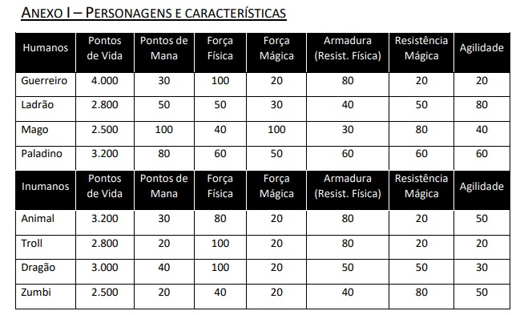
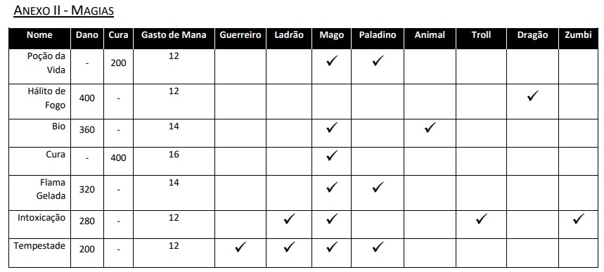
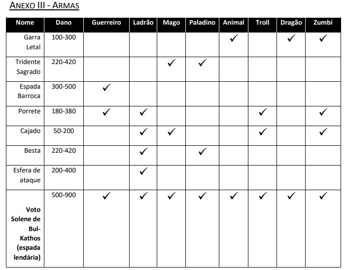

# Batalha Medieval - RPG (C++)

Jogo RPG por turnos, para ser jogado por duas pessoas, em um console. O intuito desse jogo era desenvolver habilidades de programação
em C++, testando Objetos, Ponteiros, Passagem de parâmetros e outros. O jogo foi desenvolvido em dupla.

<!--                                                                                -->

<br/>

<h1 align="center">📜 Badges do Projeto </h1>

<div align="center"> 


</div>

<div align="center"> 
<a href="https://github.com/mit018"></a>
<a href="https://github.com/brunofaria27"></a>
</div>

----

<!--                                                                                -->

<br/>

## 📑 Tabela de conteúdos

<!--ts-->
   * [Sobre](#Sobre)
   * [Regras de mágias e armas](#regras)
      * [Personagens](#personagens)
      * [Mágias](#magias)
      * [Armas](#armas)
   * [Status Porjeto](#status)
   * [Como acessar o jogo](#tecnologias)
   * [Tecnologias](#tecno)
   * [Contribuidores](#contri)
<!--te-->

<!--                                                                                -->

<br/>

<div id="sobre"></div>

# 🔔 Sobre
Em um jogo de RPG por turnos, cada personagem participante executa uma ação em seu turno sem ser interrompido por outros personagens. Esta ação pode ser um ataque, o uso de algum item ou até mesmo uma pergunta ou resposta dentro de uma conversa. 

Dois jogadores batalham para decidir o vencedor. Cada jogador pode controlar diversos 
personagens e, a cada batalha, deve escolher um de seus personagens para a disputa. 
Os personagens podem ser humanos ou inumanos. Dentre os humanos, existem guerreiros, 
ladrões, magos e paladinos. Dentre os inumanos, existem os animais, os trolls, dragões e zumbis.

Além disso, existem armas que podem estar disponíveis para cada tipo de personagem. Um 
personagem pode atacar a outro usando armas ou magia. Ao ser atacado, um personagem 
pode receber mais danos ou menos danos de acordo com sua armadura, resistência à magia e agilidade. 

O dano causado por um ataque com arma será reduzido de acordo com a armadura do 
personagem que levou o dano. *Exemplo*: um personagem com 60 de armadura, terá 60% de dano reduzido de um ataque com arma. O mesmo procedimento ocorre com o ataque por magia, porém os pontos de resistência a magia que serão aplicados para redução do dano. Agilidade garante esquiva. Todo ataque sofrido deverá ser calculado os pontos de esquiva do personagem atacado. Um personagem com 50 de pontos de agilidade, ao ser atacado, terá uma chance de 50% de se esquivar e não sofrer nenhum dano.

Todos os personagens começam com determinada quantidade de pontos de vida e 
aquele que chegar a zero pontos primeiro perde.
Nos imagens, encontram-se as regras para pontos de vida de cada categoria, pontos máximos de dano obtidos por cada arma ou magia, resistências, armaduras e agilidade. 

-----

<!--                                                                                -->

<div id="regras"></div>

## 🚩 Regras de mágias e armas

<br/>

<div id="personagens"></div>

<div align="center"> 

</div>

<br/>

-----

<br/>

<div id="magias"></div>

<div align="center"> 

</div>

<br/>

## 📝 Regras Magias
• Cada magia usada gasta os pontos de Mana especificados na tabela;

• A cada rodada sem usar magia o personagem recupera 10 pontos de Mana, respeitando seu limite máximo

• As magias de cura aumentam os pontos de vida, enquanto as de dano diminuem os pontos de vida do personagem afetado• Deve-se acrescentar a este dano de magia a porcentagem de força mágica que o personagem possui. Um personagem com 100 pontos de força
mágica, terá seu dano aumentado em 100% (este efeito não serve para cura e sim apenas para o ataque).

<br/>

<div id="armas"></div>

<div align="center"> 

</div>

<br/>

## 📝 Regras Armas
Cada personagem só pode portar uma arma por vez.

• Todos os personagens devem ser criados/iniciados utilizando a arma com o menor poder de dano disponível para si.

• É permitido ao personagem trocar de arma, porém isto é considerado uma ação de turno, ou seja, após trocar de arma, o personagem deve esperar o próximo turno para realizar outra ação.

• Observe que cada arma possui dano mínimo e dano máximo. Em cada ataque, deverá ser calculado um valor que poderá variar entre o menor dano
possível e o maior possível de cada arma.

• Após calcular o dano de arma, deve-se acrescentar a este dano a porcentagem de força física que o personagem possui. Um personagem com 100 pontos de força física, terá seu dano aumentado em 100%. 

• O início de cada turno cada jogador poderá receber a benção de Bul-Kathos (a chance é de 20%), ao receber esta benção, o jogador poderá usar, 
naquele turno, a espada lendária Voto Solene de Bul-Kathos (observe que qualquer classe pode utilizá-la). Esta espada, além de causar mais dano, 
acrescenta uma chance de acerto crítico de 30% e um dano de acerto crítico de 100%. Ou seja, no ataque com arma usando a espada lendária Voto 
Solene de Bul-Kathos, se o ataque for crítico, o dano causado será aumentado em 100% (em cima do valor do dano causado pela arma que pode 
variar de 500 a 900). Ex.: se no ataque o dano de arma calculado for de 800 e o acerto for crítico, o dano causado será de 800 + 100% = 1600. Este 
valor ainda deve ser acrescido pela força física do personagem. No caso do Guerreiro seria: 1600 + 100% = 3200 de ataque total.

------

<!--                                                                                -->

<br/>

<div id="status"></div>

# ✅ Status do projeto

	🚧 Status: 🚀 Em desenvolvimento...  🚧

<!--                                                                                -->

<br/>

<div id="acesso"></div>

# ✅ Como acessar o jogo

### 📁 Pré-requisitos

Antes de começar, você vai precisar ter instalado em sua máquina as seguintes ferramentas: [Git](https://git-scm.com), [MinGW](http://mingw-w64.org/doku.php). 
Além disto é bom ter um editor para trabalhar com o código como [VSCode](https://code.visualstudio.com/)

### 🎲 Acessando o jogo em um terminal

```bash
# Clone este repositório
$ git clone <https://github.com/brunofaria27/RPG-Game-in-c->

# Após clonado, coloque o seguinte comando no terminal
$ g++ *cpp -o main.exe

# Quando o jogo estiver em execução, você pode usar o atalho CNTRL + C para parar a execução ou utilizar a própria interface do jogo, aproveite e divirta-se.
```
<!--                                                                                -->

<br/>

<div id="tecno"></div>

# 🛠 Tecnologias

As seguintes ferramentas foram usadas na construção do projeto:

<div align="center"> 
<a href="https://docs.microsoft.com/pt-br/cpp/cpp/?view=msvc-160"></a>
</div>

<!--                                                                                -->
<br/>
<br/>

<div id="contri"></div>

<h1 align="center"><strong>🌐 Contribuidores 🌐</strong></h1>
<table align="center">
  <tr>
    <td align="center"><a href="https://www.linkedin.com/in/bruno-faria-696b88208/"><br /><sub><b>Bruno Faria</b></sub></a><br /><a href="https://github.com/brunofaria27" title="GitHub">👨‍🚀</a></td>
    <td align="center"><a href="https://www.linkedin.com/in/laura-xavier-061815208/"><br /><sub><b>Laura Xavier</b></sub></a><br /><a href="https://github.com/mit018" title="GitHub">👨‍🚀</a></td>
  </tr>
</table>